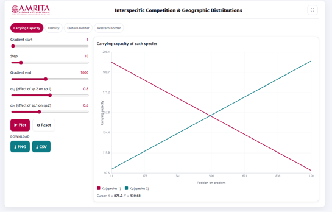

### Procedure

1. In heterogeneous environments, the carrying capacity (K) of a species may vary spatially due to differences in resource availability, habitat quality, and environmental conditions. An environmental gradient provides a framework for examining how these spatial variations influence species distributions and interspecific competition. Comparing the carrying capacity curves of competing species helps identify regions where each species is more likely to persist and contributes to understanding mechanisms underlying species coexistence and geographic distribution.
 
&nbsp;

2. The simulator enables users to investigate how the carrying capacities of two competing species vary along an environmental gradient. Users can define the gradient range, specify interspecific competition coefficients, generate graphical outputs, and compare the spatial variation in carrying capacities across the habitat.

 
&nbsp;

3. The simulator consists of two main sections: the left panel, which contains the adjustable simulation parameters and control buttons, and the right panel, which displays the graphical outputs corresponding to the selected analysis.

 
&nbsp;

4. Select the Carrying Capacity tab from the available analysis options. This view illustrates how the carrying capacities (K₁ and K₂) of the two competing species vary along an environmental gradient, enabling the study of spatial variation in habitat suitability.
 
&nbsp;

5. Specify the starting position of the environmental gradient using the Gradient start slider. This parameter defines the initial location from which the environmental gradient begins and serves as the lower boundary for the simulation.
 
&nbsp;

6. Set the number of simulation intervals using the Step slider. The step value determines the number of equally spaced computational points along the environmental gradient, thereby controlling the resolution and smoothness of the generated graph.
 
&nbsp;

7. Specify the end position of the environmental gradient using the Gradient end slider. Together with the Gradient start value, this parameter establishes the complete range of the environmental gradient over which the carrying capacities of both species are evaluated.
 
&nbsp;

8. Adjust the competition coefficient (α₁₂) using the corresponding slider. This parameter represents the competitive effect exerted by Species 2 on Species 1. Increasing or decreasing this value allows the user to investigate how changes in interspecific competition influence the carrying capacity of Species 1 across the environmental gradient.
 
&nbsp;

9. Adjust the competition coefficient (α₂₁) using the corresponding slider. This parameter represents the competitive effect exerted by Species 1 on Species 2 and enables the examination of reciprocal competitive interactions between the two species.
 
&nbsp;

10. After configuring all simulation parameters, click the Plot button to generate the graphical output. The simulator computes the carrying capacities of both species along the specified environmental gradient using the selected competition coefficients.

 
&nbsp;

11. Observe the graph displayed in the visualization panel. The graph illustrates the variation in carrying capacities of Species 1 (K₁) and Species 2 (K₂) across the specified environmental gradient.
 
&nbsp;

12. Examine the X-axis (Position on gradient), which represents different locations along the environmental gradient, extending from the specified starting position to the ending position. Observe the Y-axis (Carrying Capacity), which indicates the maximum population size that the environment can support for each species at a given position along the gradient.
 
&nbsp;

13.	Use the graph legend to distinguish between the carrying capacity curves of Species 1 (K₁) and Species 2 (K₂).
 
&nbsp;

14.	Compare the trends of the two curves to determine how the carrying capacities of the competing species change along the environmental gradient. Identify regions where one species exhibits a higher carrying capacity than the other.
 
&nbsp;

15. Observe the intersection point of the two curves. This point represents the location along the environmental gradient where both species possess equal carrying capacities under the selected simulation parameters.
 
&nbsp;

16. Move the cursor over the graph to display the corresponding coordinate values shown below the graph. These values provide the position along the environmental gradient and the corresponding carrying capacity at the selected point.
 
&nbsp;

17. Modify one or more simulation parameters and regenerate the graph to examine how changes in the environmental gradient or competition coefficients influence the carrying capacity profiles of the two species.
 
&nbsp;

18. Click the Reset button whenever it is necessary to restore the default parameter values before initiating a new simulation with different environmental conditions or competition coefficients.
 
&nbsp;

19. To preserve the simulation results, click the PNG button to download the graphical output as an image or click the CSV button to export the numerical data for subsequent statistical analysis, visualization, or reporting.
 
&nbsp;

20. Repeat the above procedure using different combinations of gradient limits and competition coefficients to investigate how changes in environmental conditions and interspecific competition influence the carrying capacities and potential geographic distributions of the two competing species. Comparing the resulting graphs provides insight into the ecological mechanisms governing species coexistence and spatial distribution patterns.
 
&nbsp;
