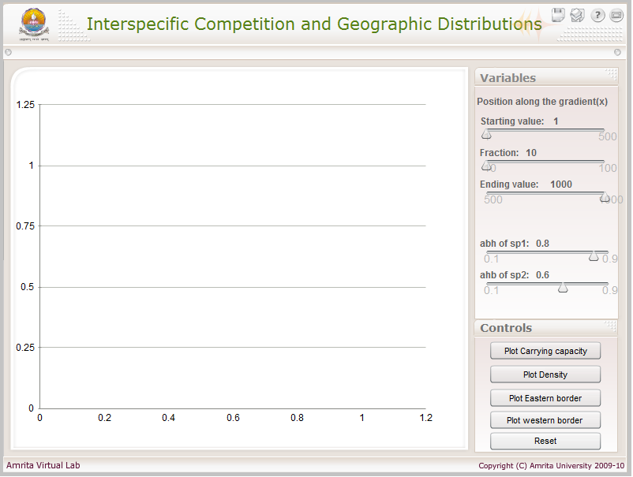
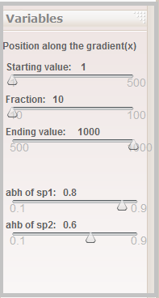
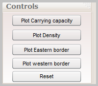
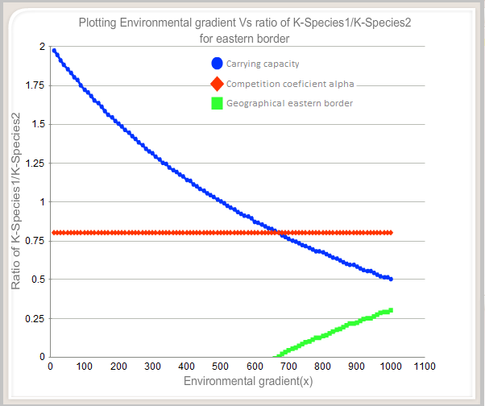

### Procedure

Procedure:

The screen shot of the simulator is as shown below.

 
&nbsp;

The simulator consists of three regions: the simulator's viewable window, the variables menu and the simulation control menu.
#### The Variables Menu:

User can enter the values for the different variables in the simulator. The variables include: Position along the gradient(x), Competition coefficient of species 1(abh of sp1) and Competition coefficient of species 2 (ahb of sp2).

 
&nbsp;

#### Simulation control menu:

These set of buttons are used for controlling the simulation. Simulation control includes: buttons for plotting Carrying Capacity, Density, Eastern border and Western border.

 
&nbsp;

#### Viewable window (Result display window):

The simulated values for the parameters are interspersed as graphs in this window.

 
&nbsp;

