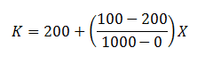
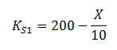
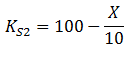
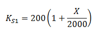
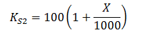
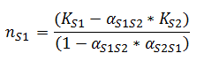
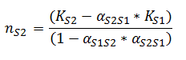
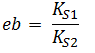
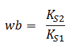

### Theory
Interspecific competition refers to the competition between individuals of different species for some limiting resource. The resources means, the features of the environment that  are required for growth, survival, or reproduction and which can be consumed to the point of depletion. Results from many studies have proved the impact and importance of competition in ecological communities (Schoener (1983),Connell (1983),Gurevitch et al. (1992)). This phenomenon has the potential to alter populations, communities as well as the evolution of interacting species. It can also limit the distributions and abundances of competing species. The other form of competition is intraspecific competition, which involves organisms of the same species.
 

### Interspecific Competition and Species Abundances
Competition can be a powerful force affecting the abundance of populations. Competition will reduce the amount of available resources to each species, when that resource is in short supply.  In most of the cases the effects of competition are asymmetrical or unequal. That is, one species is harmed more than the other. Which means that one species drives another to extinction. This has been proved in many of the past studies. Brown and Davidson (1977) carried out experiments with rodents and ants that eat the same seeds. From their experiments it has been shown that, the ant colonies increased by 71% when rodents were excluded. Another observation is that, where ants were excluded, rodents increased in both number and biomass. And when both were excluded, the number of seeds increased. That is, in natural conditions, each group would be expected to eat fewer seeds in the presence of the other group than it could eat when alone. This is only one example from a number of past studies which has proved the influence of interspecific competition on species abundances.
 

Mathematically we can model this effect of interspecific competition on species abundance and geographic distributions. Consider the case of two species in which one has a greater competitive effect on other. To model interspecific competition, we need to add a term to the equation for each species that represents the competitive effect of the other species. This is done using a competition coefficient, represented by the Greek letter alpha. The competition coefficient quantifies the inhibitory effect that one species has on another. Here, in this case, the competition coefficients are taken as αS1S2 (effect of an individual of species 2 on an individual of species 1) and αS2S1 (effect of an individual of species 1 on an individual of species 2). Let us assume that each species in its optimal environment has a carrying capacity of 200 individuals per 1000 hectares of grassland. (Carrying capacity is the maximum sustainable limit by the environment; either it is population density or the food sources). We can use this data to predict the effect of interspecific competition on population abundance and distribution of the two competing species.  Because of the changes in the relative ability of each species to use the available resources, the carrying capacities may change but the alpha values remain constant.  To determine the abundance of each species, it applies the Lotka-Volterra competition model. (Refer the experiment, Interspecific competition and coexistence -Population Ecology Virtual Lab I, For further reference on Lotka-Volterra competition model).

 

 

#### Species Abundances in the Absence of Interspecific Competition
It is useful to develop a control for the study of effect of competition on species abundance. For this, we should quantify the abundance of each species in the absence of interspecific competition. Consider, the species1 carrying capacity decreasesed to 100 at the eastern end (kilometer 1000) compared with the western end of the transect (kilometer 0). (Transects are used to illustrate a particular gradient or linear pattern along which communities of plants and, or animals change). Let us assume a straight line relationship between the carrying capacity and the distance along the gradient. So we can formulate the relationship as follows.

&nbsp;

The above equation resembles the formula of straight line. Where K is the carrying capacity and X is the distance along the gradient. On simplifying the above equation, we get,

&nbsp;

Where, K_S1 is the carrying capacity of species1.

While considering the case of species 2, its carrying capacity is 100 at the western end and increases to 200 at the eastern end. By applying the above described straight line relationship, we get,

&nbsp;

On slightly modifying these equations, it takes the form as:

&nbsp;

And

By applying these two equations we analyze the species abundance in the absence of interspecific competition.

&nbsp;

### Effect of Interspecific Competition on Species Abundances
 

Interspecific competition can reduce the abundance of the two competing species wherever they coexist. As described in the above case, we can calculate the population density of each species when they occur alone. Let us consider the scenario of effect of competition on species abundance. We can calculate the densities where they coexist. It is given by,

Where  ns1 is the population growth of Species 1 in the presence of Species 2.

&nbsp;

For species 2, the equation is given by,

Where  ns2  is the population growth of Species 2 in the presence of Species 1.

&nbsp;

### Effect of Interspecific Competition on Species Borders
 

The range of species is delimited by a line beyond which the selective factors of the environment prevent the successful reproduction. This line is called the species border. It is one of the aspects of the population structure of species and this can be understood only by considering gene flow.

It has been proved from previous studies that, competition between species has been seen as an influence on species distributions and evolution.  Ecologist Joseph Connell (1961) studied factors that influenced the distribution, survival, and reproduction of two barnacle species, Chthamalus stellatus and Balanus balanoides, on rocks along the coast of Scotland. Using removal experiments, Connell found that competition with Balanus excluded Chthamalus from all but the top of the intertidal zone.  Another similar study was carried out by Patterson (1980, 1981). He found that, when a chipmunk species lived alone on a mountain range, it occupied a broader range of habitats and elevations than when it lived with a competitor species. So it is evident that interspecific competition influences the spatial pattern and geographical distribution of animal and plant species.

Mathematically we can model the effect of interspecific competition on species borders and thus study geographic distribution of the two species when they compete with each other.

The equation to find the eastern border is given by

&nbsp;

Where  eb  is the eastern border and  Ks1 , Ks2 are the carrying capacities.
 
&nbsp;

The equation to find the western border is given by

Where  wb  is the eastern border.

&nbsp;

The equation to find the exact eastern border is given by

Where  wbr  is exact eastern border.